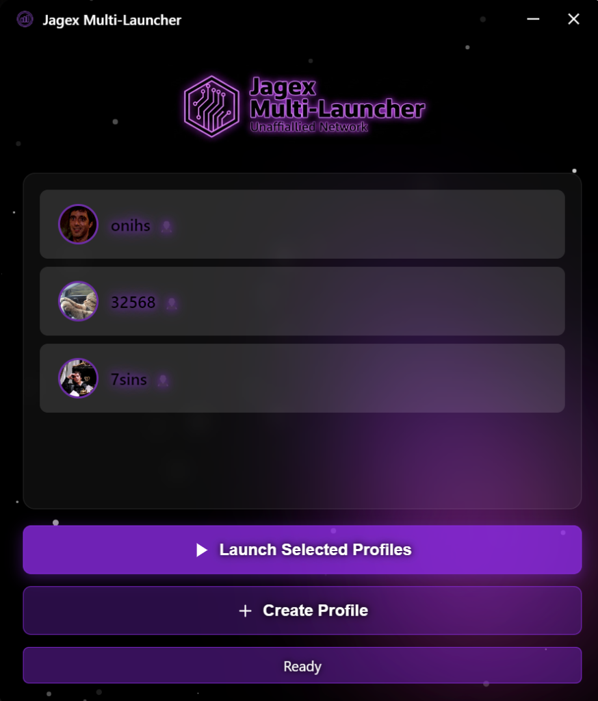
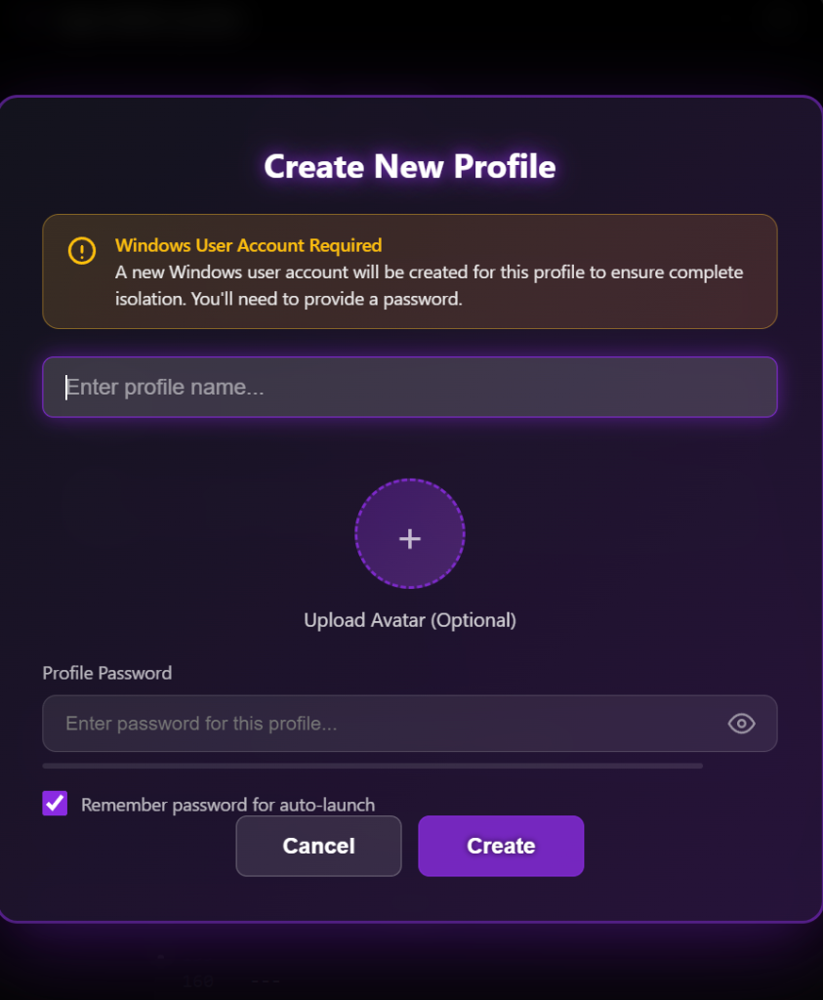
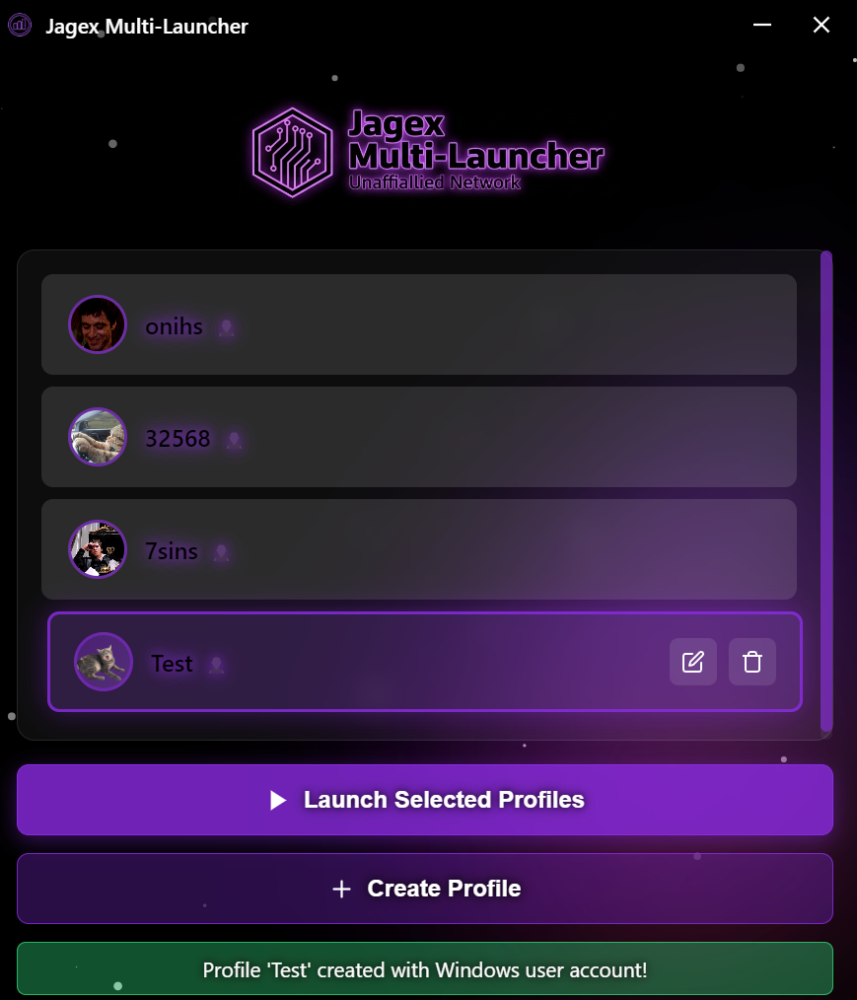
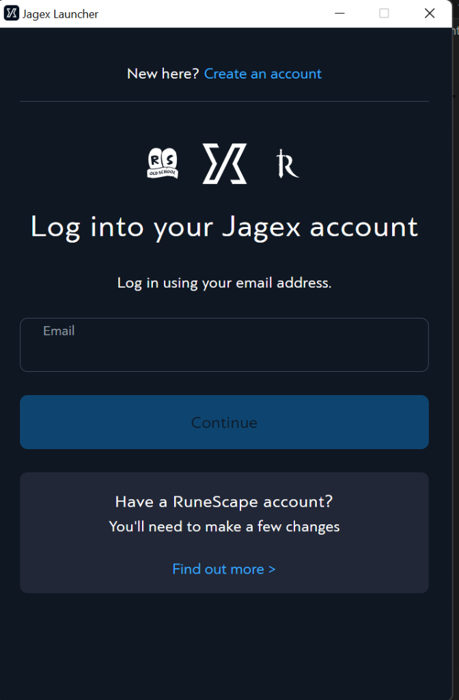
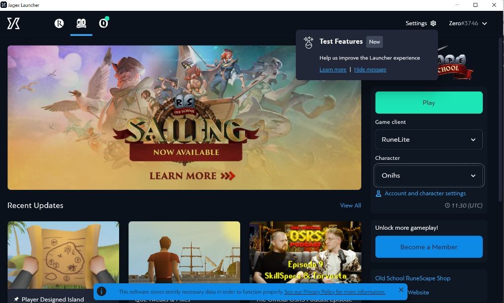

# Windows One Click Jagex Multi-Account Launcher


A lightweight Electron application that makes running multiple OSRS/RuneScape accounts simultaneously a breeze. No more frustrating logout-login cycles or complicated workarounds.

---

## 🎮 The Story

One random day, I decided to come back to Old School RuneScape after a long break. I wanted to run multiple accounts at the same time - something that should be simple, right? Wrong.

I quickly discovered that the Jagex Launcher doesn't allow you to load multiple instances without logging out of your current account first. I searched through countless forum posts and Reddit threads, only to find solutions that were either:
- Overly complicated with multiple manual steps
- Required editing system files
- Simply didn't work anymore

Frustrated with the redundant workarounds, I decided to take matters into my own hands and create this lightweight Electron application that does it all for you in one swoop.

**No more hassle. Just click and play.**

---

## ✨ Features

- 🚀 **One-Click Launch** - Select profiles and launch multiple accounts instantly
- 👤 **Windows User Isolation** - Each profile runs under its own Windows user account for complete separation
- 🔐 **Secure Password Storage** - Passwords are encrypted locally using AES-256
- 🎨 **Custom Avatars** - Personalize each profile with custom images (supports PNG, JPG, and **animated GIFs**!)
- 🌌 **Beautiful UI** - Modern, dark-themed interface with particle effects
- 📦 **Portable** - Single executable, no complex installation

---

## 📸 Screenshots

<p align="center">
  
  <br><em>Main Interface</em>
</p>

<p align="center">
  
  <br><em>Create New Profile</em>
</p>

<p align="center">
  
  <br><em>Profile Created Successfully</em>
</p>

<p align="center">
  
  <br><em>Jagex Launcher Login</em>
</p>

<p align="center">
  
  <br><em>Running Multiple Accounts</em>
</p>

---

## 📋 Use Case

This application is perfect for:

- **Multi-boxers** running multiple OSRS accounts simultaneously
- **Ironman players** who want to play their main alongside their ironman
- **Alt accounts** for various in-game activities
- Anyone tired of the logout/login dance with the official Jagex Launcher

---

## 💾 Installation

### Option 1: Download Pre-built Executable (Recommended)

1. Go to the [Releases](../../releases) page
2. Download `Jagex Multi-Launcher 1.0.0.exe`
3. Run the executable (Windows may show a SmartScreen warning - click "More info" → "Run anyway")
4. The app will request Administrator privileges (required to create Windows user accounts)

### Option 2: Build from Source

See the [Building](#-building) section below.

---

## 🔧 First Time Setup

1. **Launch the application** - You'll see the main interface with no profiles

2. **Create a Profile**
   - Click "Create Profile"
   - Enter a name for this account (e.g., "Main", "Ironman", "Alt")
   - Optionally upload an avatar image
   - **Important:** Enter a password for the Windows user account that will be created
   - Check "Remember password" for automatic launches

3. **Approve UAC Prompt**
   - Windows will show a User Account Control prompt
   - Click "Yes" to allow the app to create the Windows user account

4. **Repeat for Additional Profiles**
   - Create as many profiles as you need

5. **Launch Your Accounts**
   - Select the profiles you want to launch (click on them)
   - Click "Launch Selected Profiles"
   - The Jagex Launcher will open for each selected profile under its own user context

---

## 🛠️ Building

### Prerequisites

- [Node.js](https://nodejs.org/) (v18 or higher)
- [Git](https://git-scm.com/)
- Windows 10/11

### Steps

```bash
# Clone the repository
git clone https://github.com/Unaffiliated-Network/Jagex-Account-MultiLauncher.git
cd Jagex-Account-MultiLauncher

# Install dependencies
npm install

# Run in development mode
npm start

# Build portable executable
npx electron-builder --win portable --config.win.signAndEditExecutable=false
```

The built executable will be in the `dist` folder.

---

## ⚠️ Disclaimer & Use At Your Own Risk

> **IMPORTANT: This is an unofficial, third-party application.**

This application is **NOT affiliated with, endorsed by, or associated with Jagex Ltd.** in any way.

### Legal Considerations

- I am not a lawyer and cannot provide legal advice regarding Jagex's policies on third-party applications
- This tool is intended as a **Quality of Life (QoL) utility** - it doesn't modify game files, inject code, or provide any in-game advantages
- It simply manages Windows user accounts to allow the official Jagex Launcher to run multiple times
- **You use this application entirely at your own risk**
- The developers are **not responsible** for any actions taken against your account(s) by Jagex

### What This App Does (and Doesn't Do)

✅ **DOES:**
- Create Windows user accounts to isolate Jagex Launcher instances
- Store your credentials locally (encrypted) for convenience
- Provide a nice UI to manage multiple profiles

❌ **DOES NOT:**
- Modify any Jagex game files
- Inject code into games
- Provide bots, macros, or automation
- Send any data to external servers
- Violate game mechanics in any way

**By using this software, you acknowledge that you understand these risks and accept full responsibility.**

---

## 🔒 Privacy & Security

- All data is stored **locally** on your machine
- Passwords are encrypted using AES-256 with a machine-specific key
- No data is ever sent to external servers
- Profile data is stored in `C:\JagexProfiles\`

---

## 📄 License

MIT License - See [LICENSE](LICENSE) for details.

---

## 🤝 Contributing

Contributions are welcome! Feel free to:
- Report bugs
- Suggest features
- Submit pull requests

---

*Made with ❤️ by a frustrated OSRS player who just wanted to run two accounts*
